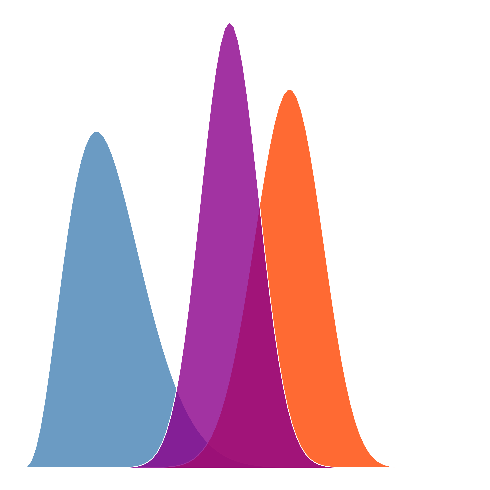

# IMSB2026 

## Introduction à la modélisation statistique bayésienne : Un cours en R et Stan avec brms

## Objectifs de la formation

L'objectif de cette formation est de vous faire découvrir la modélisation statistique bayésienne. Les concepts et outils qui seront introduits tout au long de la formation seront illustrés par des cas concrets d'analyse de données. Ce cours est construit autour du langage `R` et de l'utilisation du paquet `brms`, une interface au langage probabiliste `Stan`. Par conséquent, il est **indispensable** d'avoir quelques connaissances élémentaires du langage `R` (pour une introduction, voir [cette application](https://r-primers.andrewheiss.com) ou [ce document](https://cran.r-project.org/doc/contrib/Torfs+Brauer-Short-R-Intro.pdf)).

## Planning

| Cours | Calendrier |
|-------|:----------:|
| Cours n°01 : Introduction à l'inférence bayésienne | Lundi 19 janvier 14h-17h |
| Cours n°02 : Modèle Beta-Binomial | Mardi 20 janvier 9h-12h |
| Cours n°03 : Introduction à brms, modèle de régression linéaire | Mardi 20 janvier 14h-17h |
| Cours n°04 : Modèle de régression linéaire (suite) | Mercredi 21 janvier 9h-12h |
| Cours n°05 : Markov Chain Monte Carlo | Mercredi 21 janvier 14h-17h |
| Cours n°06 : Modèle linéaire généralisé | Jeudi 22 janvier 9h-12h |
| Cours n°07 : Comparaison de modèles | Jeudi 22 janvier 14h-17h |
| Cours n°08 : Modèles multi-niveaux (généralisés) | Vendredi 23 janvier 9h-12h |
| Cours n°09 : Examen final | Vendredi 23 janvier 14h-17h |

## Contact

[Ladislas Nalborczyk](https://lnalborczyk.github.io), prenom.nom@cnrs.fr
