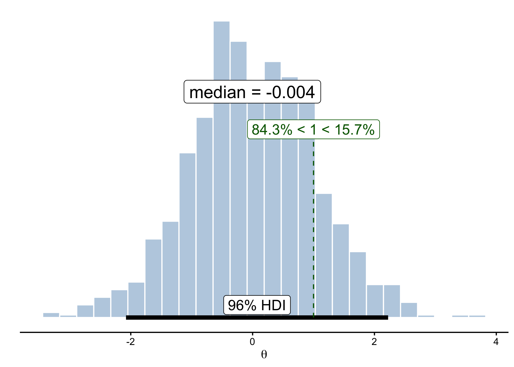

<!-- README.md is generated from README.Rmd. Please edit that file -->

# IMSB : Introduction à la modélisation statistique bayésienne

The goal of the `imsb` package is to provide all the materials (e.g.,
data, utility functions) needed for the [IMSB
course](https://www.barelysignificant.com/IMSB2026/).

## Installation

You can install the development version of `imsb` from GitHub with:

``` r
install.packages("remotes")
remotes::install_github(repo = "lnalborczyk/IMSB2026/_imsb", dependencies = TRUE)
```

## Usage

Checking the `brms` and `rstan` install.

``` r
library(imsb)
check_install()
```

Opening the slides of the first course in browser.

``` r
open_slides(cours = 01)
```

Importing the `robot` data.

``` r
open_data(robot)
```

Posterior plot in the style of the `BEST` package using the
`imsb::posterior_plot()` function.

``` r
# getting samples for a normal distribution
samples <- rnorm(n = 1e3, mean = 0, sd = 1)

# plotting it
posterior_plot(samples, credmass = 0.96, compval = 1) +
    # the resulting plot is a ggplot than can be customised at will
    ggplot2::labs(x = expression(theta) )
#> Warning: Using `size` aesthetic for lines was deprecated in ggplot2 3.4.0.
#> ℹ Please use `linewidth` instead.
#> ℹ The deprecated feature was likely used in the ggplot2 package.
#>   Please report the issue at <https://github.com/tidyverse/ggplot2/issues>.
#> This warning is displayed once every 8 hours.
#> Call `lifecycle::last_lifecycle_warnings()` to see where this warning was
#> generated.
#> Warning: The dot-dot notation (`..density..`) was deprecated in ggplot2 3.4.0.
#> ℹ Please use `after_stat(density)` instead.
#> ℹ The deprecated feature was likely used in the imsb package.
#>   Please report the issue at <https://github.com/lnalborczyk/IMSB2026/issues>.
#> This warning is displayed once every 8 hours.
#> Call `lifecycle::last_lifecycle_warnings()` to see where this warning was
#> generated.
#> Warning in ggplot2::geom_text(ggplot2::aes(x = mean(c(hdis$CI_low, hdis$CI_high)), : All aesthetics have length 1, but the data has 1000 rows.
#> ℹ Please consider using `annotate()` or provide this layer with data containing
#>   a single row.
#> Warning in ggplot2::geom_text(ggplot2::aes(x = central_tendency, y = 0.9 * : All aesthetics have length 1, but the data has 1000 rows.
#> ℹ Please consider using `annotate()` or provide this layer with data containing
#>   a single row.
#> Warning in ggplot2::geom_segment(ggplot2::aes(x = compval, xend = compval, : All aesthetics have length 1, but the data has 1000 rows.
#> ℹ Please consider using `annotate()` or provide this layer with data containing
#>   a single row.
#> Warning in ggplot2::geom_text(ggplot2::aes(x = compval, y = 0.7 * max(densCurve$y), : All aesthetics have length 1, but the data has 1000 rows.
#> ℹ Please consider using `annotate()` or provide this layer with data containing
#>   a single row.
#> `height` was translated to `width`.
```


